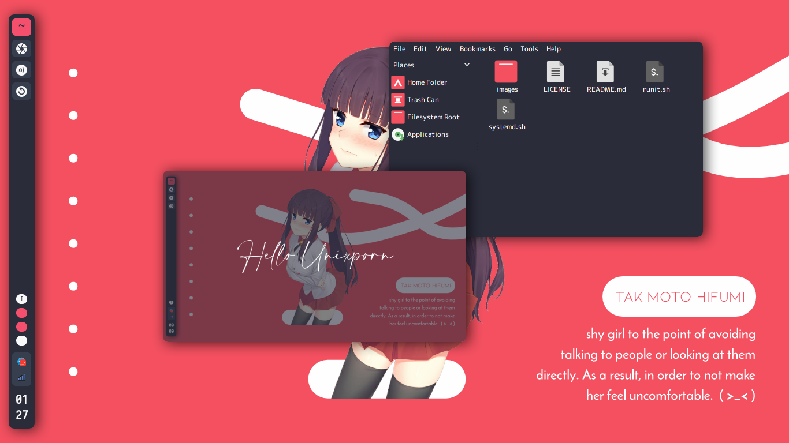
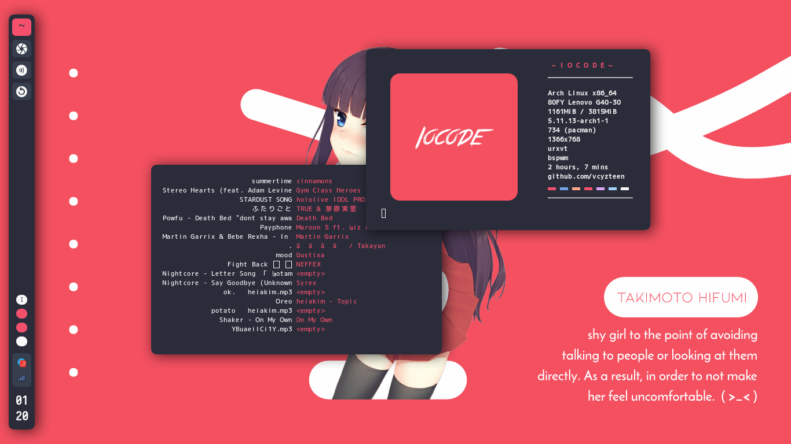

------------------------------
<h3 align="center">👋 Hi there Thanks For Visiting</h3>


------------------------------
<b><p align="center">Bspwm - dotfiles</p></b>

------------------------------

| Ark |
|-----------------------|
||

|1|2|3|
|-|-|-|
||||

------------------------------
<b><p align="center">Details</p></b>

------------------------------

```
---------------------------------------------------
|         Item          | Value                   |
| :-------------------: | :-----------------------|
|          OS           | ArchLinux, artix runit  |
|          WM           | bspwm                   |
|         Shell         | zsh                     |
|          DM           | lightdm                 |
|         Font          | M+1 / M+2               |
|      Compositor       | picom, compton          |
|     Notification      | dunst                   |
|       Terminal        | urxvt                   |
|       Launcher        | rofi, dmenu             |
|          Bar          | tint2                   |
|       Wallpaper       | feh                     |
|   Logout / Shutdown   | script                  |
|    Volume Control     | pamixer, pulseaudio     |
| Brightness Controller | keybind, mouse roll     |
|    Network Applet     | networkmanager-dmenu    |
|      Text Editor      | neovim                  |
---------------------------------------------------
```

------------------------------
<b><p align="center">Dependency ( Install Before Want Use Dotfiles )</p></b>

------------------------------

> used yay / paru for completely install dependency package
```bash

$ paru -S rsync dunst sxhkd pcmanfm python psmisc xorg-xprop xorg-xwininfo imagemagick \
ffmpeg wireless_tools bspwm pulseaudio pulseaudio-alsa alsa-utils brightnessctl nitrogen \
gsimplecal rofi tint2 qt5-styleplugins xautolock rxvt-unicode-patched xclip scrot thunar \
thunar-archive-plugin thunar-volman thunar-media-tags-plugin ffmpegthumbnailer tumbler viewnior \
mpv mpd mpc networkmanager-dmenu ncmpcpp pavucontrol parcellite neofetch w3m htop picom-ibhagwan-git \
gtk2-perl playerctl pamixer flameshot ranger nvim feh jgmenu ttf-mplus slim
```
------------------------------
<b><p align="center">Zsh-Ohmyzsh ( Optionally But Im Recommended )</p></b>

------------------------------

> optionally for customize text in terminal
```bash

$ sudo pacman -S zsh &&
chsh -s $(command -v zsh) &&
sh -c "$(curl -fsSL https://raw.githubusercontent.com/ohmyzsh/ohmyzsh/master/tools/install.sh)" &&
git clone https://github.com/zsh-users/zsh-syntax-highlighting.git ${ZSH_CUSTOM:-~/.oh-my-zsh/custom}/plugins/zsh-syntax-highlighting &&
git clone https://github.com/zsh-users/zsh-autosuggestions.git ${ZSH_CUSTOM:-~/.oh-my-zsh/custom}/plugins/zsh-autosuggestions &&
git clone https://github.com/zsh-users/zsh-completions.git ${ZSH_CUSTOM:=~/.oh-my-zsh/custom}/plugins/zsh-completions
```
------------------------------
<b><p align="center">Installation</p></b>

------------------------------

> You can clone or download it as a zip. After that put all files in the dotfiles folder to user's home directory.
```bash

$ git clone https://github.com/vcyzteen/Mydotfiles.git && cd Mydotfiles/
```
------------------------------
<b><p align="center">Enable some service</p></b>

------------------------------

> systemd.sh for systemd and runit.sh for runit ( if lazy to enable one by one )
```bash

$ sudo su
$ chmod +x runit.sh && chmod +x systemd.sh
$ bash <file.sh>
```
------------------------------
<b><p align="center">rsync file for replace dot file</p></b>

------------------------------

> Recommended & Exit Root User Before enter this command
```bash

$ rsync -avxHAXP --exclude '.git*' .* ~/
```
------------------------------
<b><p align="center">how set wallpaper</p></b>

------------------------------

> open terminal first ( note this not permanently set ) if you need set wallpaper permanently go to *~/.config/bspwm/bspwmrc* and edit this line line feh /path/to/wall/io-match.png
```bash

$ bash ~/.scripts/wallset
```

------------------------------
<b><p align="center">Slim Themes Ark-Hifumi</p></b>
<p align="center">In fact, I use SLiM for default lockscreen.</p>
<p align="center"><a href="https://drive.google.com/drive/folders/1_Ktq9kGqDi0TNC8Q49AWpLo2HvWkPhnQ?usp=sharing">
</a></p>
<p align="center">Just click on the image above!</p>

> enable slim service by

    $ sudo systemctl disable lightdm.service 
    $ sudo systemctl enable slim.service   

> and if done next step
    Extract .zip files and copy folder extracted to /usr/share/slim/themes/
    Then edit the /etc/slim.conf file using text editor. Adjust, for example as follows:

    current_theme Ark-Hifumi

> and if you want use lock screen as default

> uncomment this code first in /etc/slim.conf

    # sessiondir            /usr/share/xsessions/

> and next you can manage like this. go to .xinitrc by typing nano .xinitrc and added this code before last code

```bash

# slim-lockscreen

DEFAULTSESSION=bspwm

case "$1" in
    bspwm) exec bspwm ;;
    xfce) exec xfce4-session ;;
    gnome3) exec gnome-session ;;
    kde) exec startkde ;;
    cinnamon) exec gnome-session-cinnamon ;;
    razor-qt) exec razor-session ;;
    lxde) exec lxsession ;;
    mate) exec mate-session ;;
    *) exec $DEFAULTSESSION ;;
esac
```
> note if any exec command for bspwm ( double ) like in bellow .xinitrc have exec bspwm or dbus-launch bspwm you can delete and managed in above code

------------------------------

<b><p align="center">Spicetify - Theme</p></b>
<p align="center">theme for spotify</p>
<p align="center"><a href="https://github.com/vcyzteen/spicetify-themes/tree/master/Dribbblish">
</a></p>
<p align="center">Just click on the image above!</p>

> if you want install. first install spicetify cli by command

    $ paru -S spicetify-cli

> and if done next step you can download or clone git repo spicetify in image

```bash

$ git clone https://github.com/vcyzteen/spicetify-themes
$ cd spicetify-themes
$ cp -r * ~/.config/spicetify/Themes
$ cd "$(dirname "$(spicetify -c)")/Themes/Dribbblish"
  mkdir -p ../../Extensions
  cp dribbblish.js ../../Extensions/.
  spicetify config extensions dribbblish.js
  spicetify config current_theme Dribbblish color_scheme ark
  spicetify config inject_css 1 replace_colors 1 overwrite_assets 1
  spicetify apply
```
> done?. go restart your spotify and BOOM!

------------------------------

<b><p align="center">Credits & Many Thanks</p></b>

------------------------------

> Inspiration and resources

* [owl4ce](https://github.com/owl4ce)
* [bandithijo](https://github.com/bandithijo)
* [6gk](https://github.com/6gk)
* [adi1090x](https://github.com/adi1090x)
-----------------------------------------

<b><p align="center">Buy me a ko-fi</p></b>

------------------------------

<p align="center"><a href="https://ko-fi.com/iocode"></a>

-----------------------------------------
